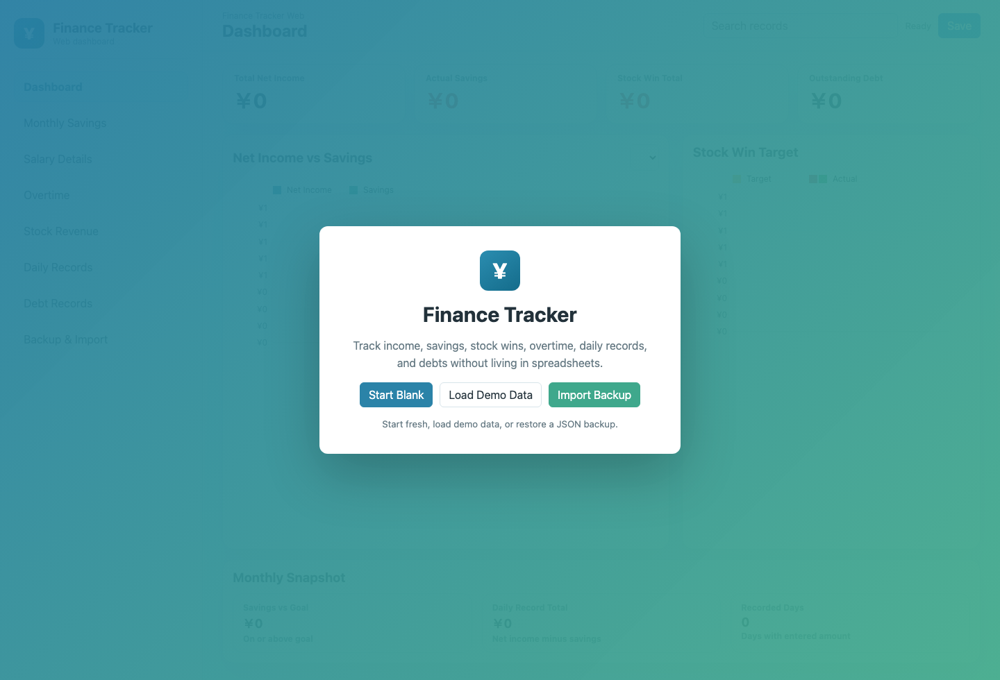
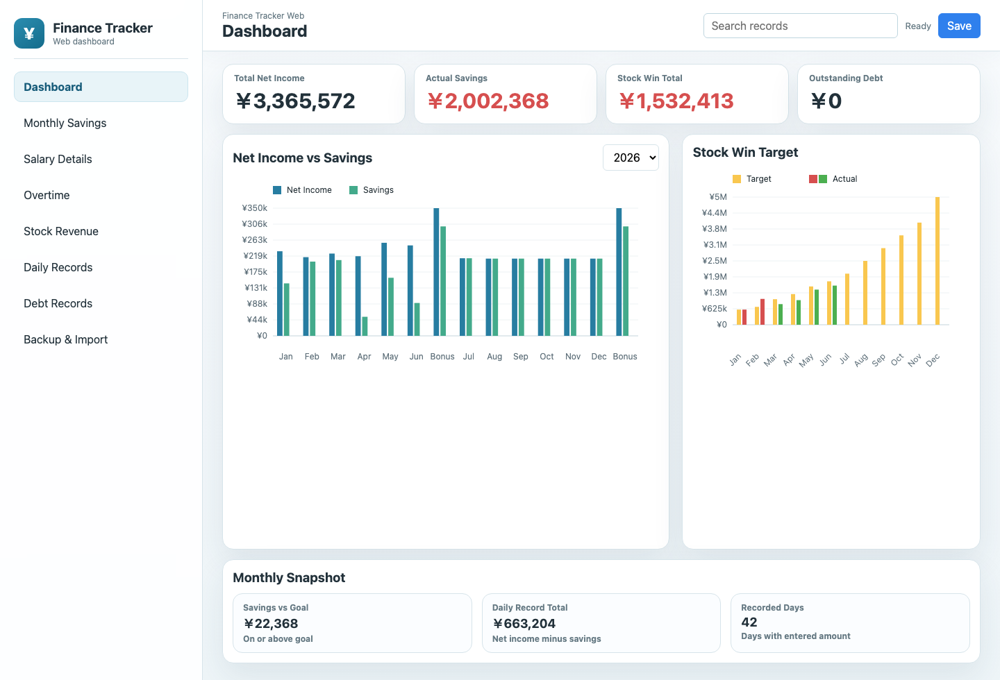

# FinanceTracker Web Demo Release Notes

Release date: 2026-06-07

## Summary

This release hardens FinanceTracker Web for public demo use on GitHub Pages. The app remains a private browser-first finance tracker using IndexedDB/localStorage and JSON backup files, with stronger rendering safety, clearer first-run options, and improved accessibility.

Live site: https://bhurtelmahesh.github.io/FinanceTrackerWeb/

## Highlights

- Added first-run `Load Demo Data` action.
- Added meta description, theme color, and web manifest.
- Added accessible navigation state, search/status labels, canvas fallback text, and generated grid labels.
- Escaped table/editor-rendered values to prevent HTML injection from typed or imported data.
- Added graceful JSON import failure handling.
- Added visible save/load failure states.
- Normalized imported data collections to arrays.
- Improved keyboard focus styling.
- Improved mobile daily-grid sizing and touch scrolling.

## Data Safety

- User data stays in browser-private storage.
- IndexedDB is used first, with localStorage fallback.
- JSON export remains the recovery and migration path.
- Invalid JSON imports now fail with a visible message rather than breaking the app flow.

## Verification

- Public page returned `200`.
- Public JavaScript and CSS assets returned `200`.
- Production build passed.
- JavaScript syntax check passed.
- Live audit confirmed metadata, manifest, accessibility hooks, import/save failure handling, table value escaping, mobile grid styling, and CSP presence.
- Screenshots below were taken after first-run UI and demo dashboard content loaded.

## Screenshots

### First-Run Screen

### Loaded Demo Dashboard

